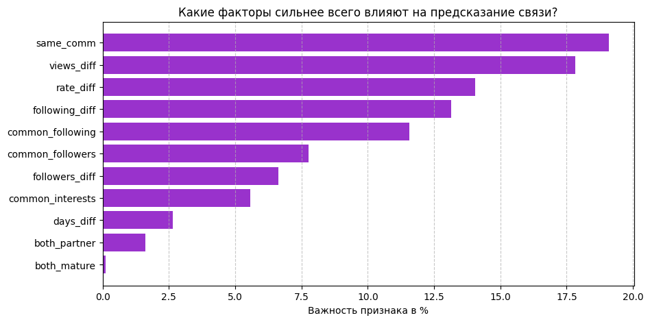

# 🎯 Link Prediction in Twitch Social Network

[](https://www.python.org/downloads/)
[](https://catboost.ai/)
[](https://pytorch-geometric.readthedocs.io/)

Сравнение двух подходов для предсказания подписок между пользователями Twitch: **CatBoost** и **GCN (графовая нейросеть)**.

---

## 📊 Сравнение результатов

| Подход | AUC-ROC | Время обучения | Количество параметров |
|--------|---------|----------------|----------------------|
| **GCN** | **0.9134** | 116.71 сек | ~70K |
| **CatBoost** | **0.9004** | 110.93 сек | ~500 деревьев |

> 🏆 **GCN** показал лучшее качество

---

## 📊 GCN (PyTorch Geometric) — ЛУЧШИЙ РЕЗУЛЬТАТ: 0.9134

### Прогресс обучения

| Эпоха | Train Loss | Test ROC-AUC |
|-------|------------|--------------|
| 010 | 0.6362 | 0.8463 |
| 050 | 0.4554 | 0.8894 |
| 100 | 0.3692 | 0.9074 |
| 150 | 0.3292 | 0.9108 |
| **210** | **0.3020** | **0.9134** 🏆 |

### Гиперпараметры

```python
model = TwitchLinkPrediction(
    'epoch':210,
    'hidden_channels': 128,
    'dropout': 0.75,
    'learning_rate': 0.01
)
```

---

## 📊 CatBoost — РЕЗУЛЬТАТ: 0.9004

### Прогресс обучения

| Итерация | Test AUC |
|----------|----------|
| 0 | 0.8795 |
| 100 | 0.8975 |
| 200 | 0.8994 |
| 300 | 0.8998 |
| 400 | 0.9002 |
| **500** | **0.9004** 🏆 |

### Важность признаков

| Признак | Описание | Важность |
|---------|----------|----------|
| **same_comm** | В одном сообществе | **19.1%** |
| **views_diff** | Разница в просмотрах | **17.8%** |
| **rate_diff** | Разница в PageRank | **14.1%** |
| **following_diff** | Разница в подписках | **13.1%** |
| **common_following** | Общие подписки | **11.6%** |
| **common_followers** | Общие подписчики | **7.8%** |
| **followers_diff** | Разница в подписчиках | **6.6%** |
| **common_interests** | Общие интересы (теги) | **5.6%** |
| **days_diff** | Разница в возрасте аккаунта | **2.6%** |
| **both_partner** | Оба партнеры Twitch | **1.6%** |
| **both_mature** | Оба имеют взрослый контент | **0.1%** |

### Гиперпараметры

```python
model = CatBoostClassifier(
    iterations=600,
    learning_rate=0.03,
    depth=6,
    eval_metric='AUC',
    random_seed=42
)
```

---

## 🧠 Методология

### 1. Построение графа
- **Узлы**: пользователи Twitch
- **Ребра**: существующие подписки
- **Ориентированный граф** (учитываем направление: кто на кого подписан)

### 2. Признаки узлов

| Признак | Описание |
|---------|----------|
| `followers` | Количество подписчиков (in-degree) |
| `following` | Количество подписок (out-degree) |
| `rate` | Важность узла (PageRank) |
| `community` | Сообщество (Louvain) |
| `days` | Возраст аккаунта |
| `mature` | Взрослый контент (0/1) |
| `partner` | Партнер Twitch (0/1) |
| `views` | Количество просмотров |

---

## 📈 Визуализация важности признаков (CatBoost)



---

## 💡 Выводы

| Аспект | CatBoost | GCN |
|--------|----------|-----|
| **Качество** | 0.9004 | **0.9134** 🏆 |
| **Скорость** | **110.93 сек**🏆 | **116.71 сек** |
| **Интерпретируемость** | ✅ Высокая | ❌ Сложная |

**Рекомендация:**
- Для нахождения конкретных признаков → **CatBoost** (понятные признаки,немного быстрее)
- Для максимального качества и скорости → **GCN** (0.9134, лучше улавливает структуру графа)

**🔬 Почему GCN выиграл?**

1. **Структура графа**: GCN автоматически учитывает глобальные связи между узлами, а CatBoost видит только локальные признаки пар
2. **Эмбеддинги**: GCN учит компактные представления (128 чисел на узел), которые содержат информацию о всех соседях
3. **Масштабируемость**: GCN легко расширяется на графы с миллионами узлов

---

## 🚀 Запуск

### 1. Клонировать репозиторий
```bash
git clone https://github.com/MimiCyberAlt/catboost&gcn-twitch-link-prediction.git
cd catboost&gcn-twitch-link-prediction
```

### 2. Установить зависимости
```bash
pip install -r requirements.txt
```

### 3. Скачать данные
Данные доступны на Kaggle:  
[https://www.kaggle.com/datasets/andreagarritano/twitch-social-networks](https://www.kaggle.com/datasets/andreagarritano/twitch-social-networks)

### 4. Запустить обучение
```bash
python link_prediction.py  # CatBoost
# или
python gcn_link_prediction.py  # GCN
```

---

## 📁 Структура проекта

```
catboost&gcn-twitch-link-prediction/
│
├── README.md                 # Описание проекта
├── requirements.txt          # Зависимости
├── link_prediction.py        # CatBoost
├── gcn_link_prediction.py    # GCN
│
├── data/                     # Данные (не включены)
│   ├── edges.csv
│   ├── target.csv
│   └── features.json
│
└── results/
    └── feature_importance.png
```

---

## 📝 Лицензия

MIT License

---

⭐ **Если проект был полезен, поставьте звезду!**
